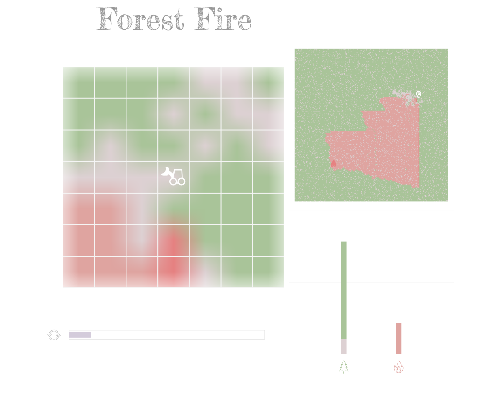
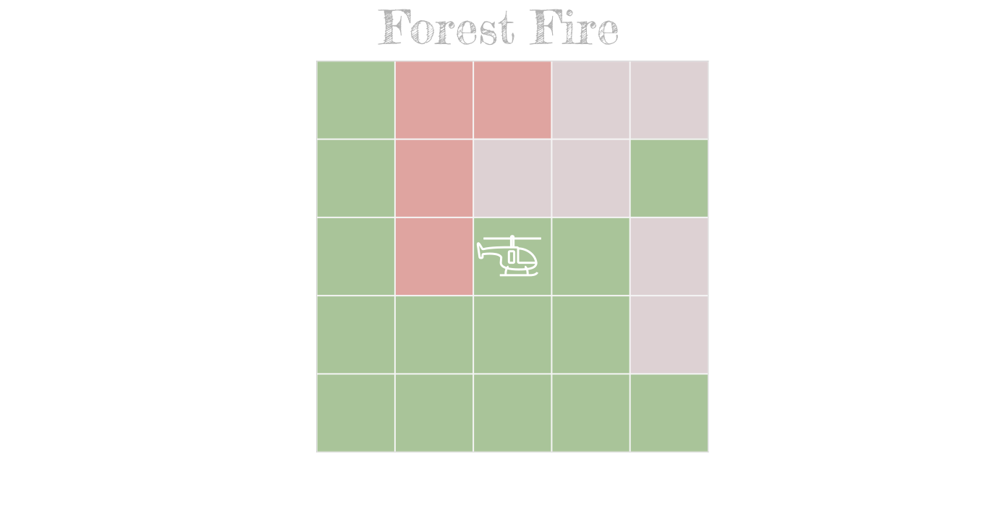

```{r setup, include=FALSE}
library(emo)
options(htmltools.dir.version = FALSE)
knitr::opts_chunk$set(
  fig.width=9, fig.height=3.5, fig.retina=3,
  out.width = "100%",
  cache = FALSE,
  echo = TRUE,
  message = FALSE, 
  warning = FALSE,
  fig.show = TRUE,
  hiline = TRUE
)
```

```{r xaringan-themer, include=FALSE, warning=FALSE}
green_rom <- "#A9C499"
red_rom <- "#DFA4A0"
white <- "#FFFFFF"
dark_red <- "#9C7370"
gray_rom <- "#DDD1D3"

library(xaringanthemer)
style_duo_accent(primary_color = green_rom, secondary_color = red_rom,
                 text_color = dark_red,
                 title_slide_text_color = white,
                 inverse_header_color = white,
                 colors = c(
                  green = green_rom,
                  red = red_rom,
                  white = white,
                  dark_red = dark_red,
                  gray = gray_rom)
                 )

WIP <- ji_glue(":woman_construction_worker: :construction: :man_construction_worker:")

```


class: inverse



---

class: inverse

## Disclaimer

This is my current understanding of the project and the measures that follow from there. You are invited to disagree.

My goal is to discuss and set everybody on the same page.

---

## CARL Modules

CARL overall structure:

The modules of CARL (from bottom to top):
1. GYMCA
2. Agents
3. Paper Experiments
4. Paper Writing (deliverable)

???

Four modules and their interactions have to be defined and built.

---
## CARL Modules
### How to build a Module?

1. `r rep(ji("star"), 1)` Prototype
2. `r rep(ji("star"), 2)` Architecture
3. `r rep(ji("star"), 3)` Get it (Fill in the Architecture)
4. `r rep(ji("star"), 4)` Polish it

???

Synonyms:
- Architecture (software)
- Process (collaboration)
- Outline (writing)

Step `2.5` _tracer bullet_.

---

## CARL Modules
### Where are we?

1. `r rep(ji("star"), 3)` GYMCA (Getting it)
2. `r rep(ji("star"), 2)` Agents (Architecture)
3. `r rep(ji("star"), 1)` Paper Experiments (Prototype)
4. `r rep(ji("star"), 1)` Paper Writing (Prototype)

---

## Paper
### Types

Paper types:
1. `r ji_glue(":earth_americas: :space_invader:")` Environment Centric (modeling, CAs)
2. `r ji_glue(":robot: :video_game:")` Agent Centric (algorithmic, RLs)
3. Other (do not know, holistic?)

---

## Paper
### Prerequisites

Paper requires:
+ Environments
+ Agents

--

So they are our primitives and should be more clearly defined.

---

## Prerequisites

A _Bottom-Up Approach_ works well when we do not have clarity about the final result.

--

So for the moment we should focus on the GYMCA and Agent modules.

---

## Interactions

Interactions between modules.

---

## Interactions
### GYMCA - Paper
#### GYMCA vision

_CA Envs_ on GYMCA should be:
+ Interesting
+ Used for reference
  + Simple

--

Agents are allowed into the _repo_ as long as they align with _GYMCA vision_. 

---
## Interactions
### GYMCA - Paper

Classification of environments:

+ Interesting
    + Publishable
        + CARL Paper

???

Interesting: An unexpected trait. It is a powerful heuristic for research.

---

## Interactions
### GYMCA - Agents

How to find interesting _environments_?

--

#### The Meta Problem

> The problem on how to find _interesting_ problems.

---

## Interactions
### GYMCA - Agents
#### The Meta Problem

The solution codifies the problem so ...

--

> ... an _interesting solution_ signals an _interesting problem_.

--

So we are _kinda_ justified for tweaking the environments ...

---

### Agents - Paper

### `r WIP`

---

## Solutions
### `r ji("package")` One _repository_ per _module_

Module | Repo | Comments
------ | -----| -----
**GYMCA** | `gym-cellular-automata` | -
**Agents** | `CARL-agents` | -
**Paper Experiments** | `CARL-experiments` | Selected Envs & Agents
**Paper Writing** | `CARL` | -

---

## Solutions
### `r ji("package")` Agents Repo

+ `./`
  + `README.md`
  + `...`
  + `agents/`
      + `algoName_i1.py`
      + `algoName_i1.yaml`
      + `...`
  + `results/`
      + `algoName_i1/`
        + `Undefined`
        + `train.py`
        + `plot.py`
          + `utils.py`
  

---

## Solutions
### `r ji("package")` Agents Repo

> Hyperparameters File ...

--

### `r WIP`

---

class: inverse, middle

## Thanks!



---

class: inverse, center, middle

## Extra Slides

---

## Architecture Status

Architecture:
1. Kludge
2. Test
3. Stable

---

## GYMCA Architecture

Architecture Status: Test

0. Utils (gym utils, spaces, parsing, rendering, neighbors)
1. Operators
2. MDP
3. Environment

---

## GNU policy for bugs

--

### A random GNU tool

```
... If it's not clear whether you
should be able to do something or not, report that too; it's a bug in
the documentation! ...
```

--

```
... Before reporting a bug or trying to fix it yourself, try to isolate
it to the smallest possible input file that reproduces the problem. ...
```

???

From the `m4` documentation
